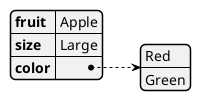
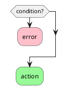

## How to add PlantUML to a markdown file


Code:

```plantumlcode
@startjson
{
   "fruit":"Apple",
   "size":"Large",
   "color": ["Red", "Green"]
}
@endjson

```

Output:



Code: 

```plantumlcode
@startuml
if (condition?) then
  #pink:error;
  kill
endif
#palegreen:action;
@enduml
```

